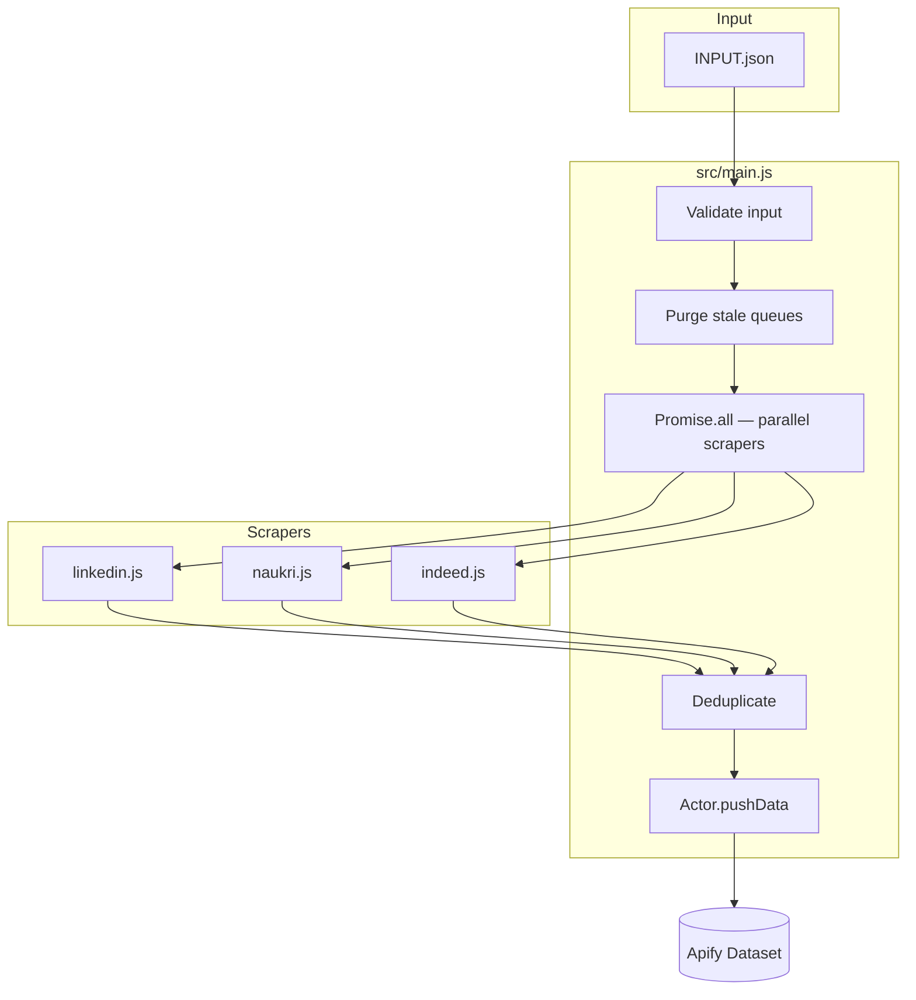

<div align="center">

# Multi-Source Job Scraper

**Production-ready Apify Actor** that searches jobs from LinkedIn, Naukri, and Indeed India — merges results, removes duplicates, and saves to an Apify Dataset.

<br />

[](https://nodejs.org/)
[](https://docs.apify.com/sdk/js)
[](https://crawlee.dev/)
[](https://playwright.dev/)
[](LICENSE)

[Quick Start](#-quick-start) · [Local Run](#-local-development) · [Deploy](#-apify-cloud-deployment) · [Input / Output](#-input--output) · [Troubleshooting](#-troubleshooting)

</div>

---

## What it does

| Step | Action |
|:----:|--------|
| 1 | Accept a **keyword** + **location** |
| 2 | Scrape **LinkedIn**, **Naukri**, and **Indeed India** in parallel |
| 3 | **Deduplicate** by title + company + location |
| 4 | Save unified results to the **Apify Dataset** |

```
Flutter Developer + Kochi  →  LinkedIn (4) + Naukri (10) + Indeed (10)  →  13 unique jobs
```

---

## At a glance

| | |
|---|---|
| **Actor name** | `multi-source-job-scraper` |
| **Actor version** | `1.0` (Apify format: `MAJOR.MINOR`) |
| **Entry point** | `src/main.js` |
| **Runtime** | Node.js 22+, ES Modules |
| **Engine** | Crawlee `PlaywrightCrawler` + Chromium |
| **Cloud memory** | 4096 MB · **Timeout** 3600 s |

### Supported job boards

| Source key | Platform | URL |
|:-----------|:---------|:----|
| `linkedin` | LinkedIn Jobs | [linkedin.com/jobs/search](https://www.linkedin.com/jobs/search/) |
| `naukri` | Naukri | [naukri.com](https://www.naukri.com/) |
| `indeed` | Indeed India | [in.indeed.com/jobs](https://in.indeed.com/jobs) |

---

## Features

| Feature | Description |
|---------|-------------|
| Multi-source | One run, three job boards |
| Parallel | All sources scrape simultaneously |
| Deduplication | Smart merge by title + company + location |
| Pagination | Auto-paginates until limit is reached |
| Retries | 3 retries per failed page (Crawlee) |
| Rate limiting | Per-source delays between pages |
| Fault tolerant | One source failing won't crash the actor |
| Cloud ready | Dockerfile, input schema, Apify config included |

---

## Tech stack

| Package | Version | Role |
|---------|---------|------|
| [Node.js](https://nodejs.org/) | 22+ | Runtime |
| [Apify SDK](https://docs.apify.com/sdk/js) | 3.x | Actor lifecycle, dataset, logging |
| [Crawlee](https://crawlee.dev/) | 3.x | Crawler, retries, request queues |
| [Playwright](https://playwright.dev/) | 1.x | Headless browser automation |

---

## Architecture



Each scraper runs its own **PlaywrightCrawler** and **dedicated request queue** (`job-scraper-linkedin`, `job-scraper-naukri`, `job-scraper-indeed`) to avoid lock conflicts during parallel runs.

---

## Project structure

```
multi-source-job-scraper/
├── .actor/
│   ├── actor.json              # Apify actor config
│   ├── input_schema.json       # Console input form
│   └── INPUT.json              # Default input for apify run
├── src/
│   ├── main.js                 # Entry point & orchestrator
│   ├── scrapers/
│   │   ├── linkedin.js
│   │   ├── naukri.js
│   │   └── indeed.js
│   └── utils/
│       ├── browser.js          # Crawlee / Playwright config
│       ├── deduplicate.js
│       └── logger.js
├── Dockerfile                  # Apify Cloud build
├── .dockerignore
├── package.json
└── README.md
```

Local run output is written to `storage/datasets/default/`.

---

## Prerequisites

| Tool | Min version | Verify |
|------|-------------|--------|
| Node.js | 22.0.0 | `node --version` |
| npm | 9.0.0 | `npm --version` |
| Apify CLI | latest | `apify --version` |

Install Apify CLI (needed for `npm run dev` and `apify push`):

```bash
npm install -g apify-cli
```

---

## Quick Start

### Windows (PowerShell)

```powershell
# 1. Clone & enter project
cd d:\personal\apify_actor

# 2. Install dependencies (+ Playwright Chromium)
npm install

# 3. Install Apify CLI
npm install -g apify-cli

# 4. Run locally
npm start
```

### macOS / Linux

```bash
git clone <your-repo-url>
cd apify_actor
npm install
npm install -g apify-cli
npm start
```

---

## Local development

### 1 · Configure input

Edit this file:

```
storage/key_value_stores/default/INPUT.json
```

```json
{
  "keyword": "Flutter Developer",
  "location": "Kochi",
  "sources": ["linkedin", "naukri", "indeed"],
  "maxItemsPerSource": 10
}
```

### 2 · Run the actor

| Command | Description |
|---------|-------------|
| `npm start` | Run with Node.js (fastest) |
| `npm run dev` | Run via Apify CLI + purge storage |

### 3 · View results

```
storage/datasets/default/
```

Each job is saved as a numbered JSON file (`000000001.json`, …).

### Verified sample run

Input: `Flutter Developer` · `Kochi` · `maxItemsPerSource: 10`

| Metric | Count |
|--------|------:|
| LinkedIn scraped | 4 |
| Naukri scraped | 10 |
| Indeed scraped | 10 |
| Before deduplication | 24 |
| Duplicates removed | 11 |
| **Unique jobs saved** | **13** |

<details>
<summary><strong>Sample terminal output</strong></summary>

```
INFO  Cleared stale source request queues
INFO  LinkedIn page offset 0: found 4 jobs
INFO  Naukri page 1: found 40 jobs
INFO  Indeed page offset 0: found 32 jobs
INFO  Removed 11 duplicate job(s)
INFO  Records saved to dataset: 13
INFO  ========== SCRAPING SUMMARY ==========
INFO  Total LinkedIn jobs: 4
INFO  Total Indeed jobs:   10
INFO  Total Naukri jobs:   10
INFO  Total unique jobs:   13
INFO  ======================================
INFO  Actor finished
```

</details>

> **Windows tip:** Use `;` instead of `&&` in PowerShell:  
> `cd d:\personal\apify_actor; npm start`

---

## Apify Cloud deployment

### Deploy in 3 steps

```powershell
apify login
apify push
```

Then open [Apify Console](https://console.apify.com/actors) → **Multi-Source Job Scraper** → **Start**.

### Docker build

Uses the official Playwright Chrome image:

```dockerfile
FROM apify/actor-node-playwright-chrome:22
COPY --chown=myuser:myuser package*.json ./
RUN npm install --omit=dev --omit=optional
COPY --chown=myuser:myuser . ./
CMD npm start --silent
```

> `--chown=myuser:myuser` is required — Apify images run as non-root user `myuser`.

### Recommended cloud settings

| Setting | Value | Why |
|---------|-------|-----|
| Memory | 4096 MB | 3 parallel browser instances |
| Timeout | 3600 s | Large pagination runs |
| Actor version | `1.0` | Must be `MAJOR.MINOR` (not `1.0.0`) |

---

## Input & Output

### Input fields

| Field | Type | Required | Default | Description |
|-------|------|:--------:|---------|-------------|
| `keyword` | string | ✅ | — | Job title or keyword |
| `location` | string | ✅ | — | City or region |
| `sources` | string[] | — | all 3 | `linkedin`, `naukri`, `indeed` |
| `maxItemsPerSource` | integer | — | `50` | Max jobs per source (1–500) |

<details>
<summary><strong>Input examples</strong></summary>

**All sources**

```json
{
  "keyword": "Flutter Developer",
  "location": "Kochi",
  "sources": ["linkedin", "naukri", "indeed"],
  "maxItemsPerSource": 50
}
```

**Indeed only**

```json
{
  "keyword": "React Developer",
  "location": "Bangalore",
  "sources": ["indeed"],
  "maxItemsPerSource": 25
}
```

</details>

### Output schema

**Common fields (all sources)**

| Field | Type | Description |
|-------|------|-------------|
| `source` | string | `linkedin` · `naukri` · `indeed` |
| `title` | string | Job title |
| `company` | string | Company name |
| `location` | string | Job location |
| `jobUrl` | string | Direct link to posting |
| `postedDate` | string | Reserved (empty for now) |
| `scrapedAt` | string | ISO 8601 timestamp |

**Extra fields by source**

| Field | Sources |
|-------|---------|
| `salary` | Naukri, Indeed |
| `experience` | Naukri |

<details>
<summary><strong>Output JSON examples</strong></summary>

**LinkedIn**

```json
{
  "source": "linkedin",
  "title": "Flutter Developer",
  "company": "ABC Technologies",
  "location": "Kochi, Kerala, India",
  "jobUrl": "https://www.linkedin.com/jobs/view/1234567890",
  "postedDate": "",
  "salary": "",
  "scrapedAt": "2026-06-08T10:30:00.000Z"
}
```

**Naukri**

```json
{
  "source": "naukri",
  "title": "Flutter Developer",
  "company": "XYZ Pvt Ltd",
  "location": "Kochi",
  "jobUrl": "https://www.naukri.com/job-listings-...",
  "experience": "2-5 Yrs",
  "salary": "5-8 Lacs PA",
  "scrapedAt": "2026-06-08T10:30:00.000Z"
}
```

**Indeed**

```json
{
  "source": "indeed",
  "title": "Flutter Developer",
  "company": "Tech Corp",
  "location": "Kochi, Kerala",
  "jobUrl": "https://in.indeed.com/viewjob?jk=abc123",
  "salary": "₹6,00,000 - ₹10,00,000 a year",
  "scrapedAt": "2026-06-08T10:30:00.000Z"
}
```

</details>

Export from Apify Console as **JSON**, **CSV**, **Excel**, or via the [Dataset API](https://docs.apify.com/api/v2/dataset-items-get).

---

## Source scrapers

### LinkedIn Jobs

| | |
|---|---|
| **File** | `src/scrapers/linkedin.js` |
| **URL** | `linkedin.com/jobs/search/?keywords=…&location=…&start=…` |
| **Page size** | 25 · **Rate limit** 2000 ms · **Retries** 3 |
| **Fields** | title, company, location, jobUrl |

### Naukri

| | |
|---|---|
| **File** | `src/scrapers/naukri.js` |
| **Primary URL** | `naukri.com/{keyword-slug}-jobs-in-{location-slug}` |
| **Fallback URL** | `naukri.com/job-listings?k=…&l=…` |
| **Page size** | ~20 · **Rate limit** 1500 ms · **Retries** 3 |
| **Fields** | title, company, location, experience, salary, jobUrl |

### Indeed India

| | |
|---|---|
| **File** | `src/scrapers/indeed.js` |
| **URL** | `in.indeed.com/jobs?q=…&l=…&start=…` |
| **Page size** | 10 · **Rate limit** 1500 ms · **Retries** 3 |
| **Fields** | title, company, location, salary, jobUrl |

---

## Deduplication

Duplicate jobs are removed using a composite key:

```
normalize(title) | normalize(company) | normalize(location)
```

Normalization: lowercase → trim → collapse spaces → strip punctuation.

The **first occurrence** is kept when merging results from all sources.

---

## Error handling

| Scenario | Behavior |
|----------|----------|
| One source fails | Others continue; partial results saved |
| All sources fail | Warning logged; empty dataset |
| Invalid input | Actor exits with error |
| Page fails after 3 retries | Logged; scraper continues with collected data |
| Bot block / 403 | Source returns 0 jobs; actor still finishes |

---

## Commands cheat sheet

### Setup

```bash
npm install                  # Install deps + Playwright Chromium
npm install -g apify-cli     # Install Apify CLI
```

### Local

```bash
npm start                    # Run actor
npm run dev                  # Run via Apify CLI (purge storage)
node --check src/main.js     # Syntax check
```

### Deploy

```bash
apify login                  # Authenticate (browser popup)
apify push                   # Build & deploy to Apify Cloud
apify info                   # Show actor status
```

### Playwright

```bash
npx playwright install chromium
npx playwright --version
```

---

## Troubleshooting

<details>
<summary><strong><code>'apify' is not recognized</code> (Windows)</strong></summary>

```powershell
npm install -g apify-cli
apify --version
npm run dev
```

</details>

<details>
<summary><strong><code>Input schema is not valid (items.enum is not allowed)</code></strong></summary>

Use `"editor": "select"` (not `"stringList"`) for the `sources` array in `.actor/input_schema.json`. Already fixed in this project.

</details>

<details>
<summary><strong><code>requestsTotal: 0</code> — instant 0 jobs</strong></summary>

Stale Crawlee queues caused skipped URLs. Fixed via `purgeAllSourceQueues()` in `src/main.js`.

Manual fix if needed:

```powershell
Remove-Item -Recurse -Force storage\request_queues
npm start
```

</details>

<details>
<summary><strong><code>EACCES: permission denied, open package-lock.json</code> on apify push</strong></summary>

Docker `COPY` must use `--chown=myuser:myuser`. Already fixed in `Dockerfile`.

Also ensure `.actor/actor.json` version is `"1.0"` not `"1.0.0"`.

</details>

<details>
<summary><strong>Intermittent 0 jobs / 403 blocked</strong></summary>

Job boards rate-limit headless browsers. Try:

- Run again (results vary)
- Use `npm run dev` for clean storage
- Deploy to Apify Cloud for better success rates
- Scrape fewer sources per run

</details>

<details>
<summary><strong><code>Warning: You are not logged in</code> during local run</strong></summary>

This is normal. Login is **not required** for `npm start` or `npm run dev`.  
Only needed for `apify push` and cloud features.

</details>

---

## License

ISC

---

<div align="center">

Built with [Apify](https://apify.com) · [Crawlee](https://crawlee.dev) · [Playwright](https://playwright.dev)

</div>
